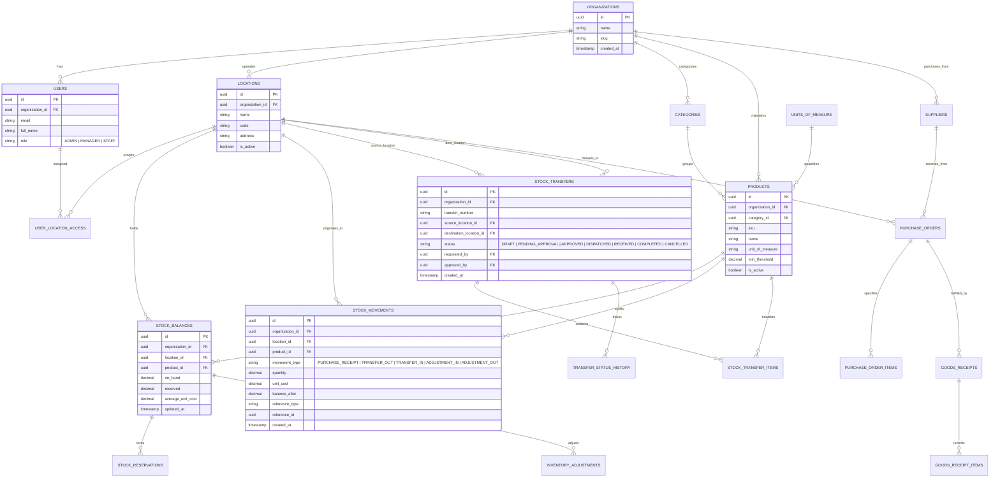

# Entity Relationship Diagram (ERD) — ASTRAVA Inventory Management System

```mermaid
erDiagram
    ORGANIZATIONS ||--o{ USERS : "has"
    ORGANIZATIONS ||--o{ LOCATIONS : "operates"
    ORGANIZATIONS ||--o{ CATEGORIES : "categorizes"
    ORGANIZATIONS ||--o{ PRODUCTS : "maintains"
    ORGANIZATIONS ||--o{ SUPPLIERS : "purchases_from"

    USERS ||--o{ USER_LOCATION_ACCESS : "assigned"
    LOCATIONS ||--o{ USER_LOCATION_ACCESS : "scopes"

    CATEGORIES ||--o{ PRODUCTS : "groups"
    UNITS_OF_MEASURE ||--o{ PRODUCTS : "quantifies"

    PRODUCTS ||--o{ STOCK_BALANCES : "stocked_in"
    LOCATIONS ||--o{ STOCK_BALANCES : "holds"

    PRODUCTS ||--o{ STOCK_MOVEMENTS : "audits"
    LOCATIONS ||--o{ STOCK_MOVEMENTS : "originates_in"

    STOCK_BALANCES ||--o{ STOCK_RESERVATIONS : "locks"
    STOCK_BALANCES ||--o{ INVENTORY_ADJUSTMENTS : "adjusts"

    LOCATIONS ||--o{ STOCK_TRANSFERS : "source_location"
    LOCATIONS ||--o{ STOCK_TRANSFERS : "dest_location"
    STOCK_TRANSFERS ||--o{ STOCK_TRANSFER_ITEMS : "contains"
    PRODUCTS ||--o{ STOCK_TRANSFER_ITEMS : "transfers"
    STOCK_TRANSFERS ||--o{ TRANSFER_STATUS_HISTORY : "tracks"

    SUPPLIERS ||--o{ PURCHASE_ORDERS : "receives_from"
    LOCATIONS ||--o{ PURCHASE_ORDERS : "delivers_to"
    PURCHASE_ORDERS ||--o{ PURCHASE_ORDER_ITEMS : "specifies"
    PURCHASE_ORDERS ||--o{ GOODS_RECEIPTS : "fulfilled_by"
    GOODS_RECEIPTS ||--o{ GOODS_RECEIPT_ITEMS : "records"

    ORGANIZATIONS {
        uuid id PK
        string name
        string slug
        timestamp created_at
    }

    LOCATIONS {
        uuid id PK
        uuid organization_id FK
        string name
        string code
        string address
        boolean is_active
    }

    USERS {
        uuid id PK
        uuid organization_id FK
        string email
        string full_name
        string role "ADMIN | MANAGER | STAFF"
    }

    PRODUCTS {
        uuid id PK
        uuid organization_id FK
        uuid category_id FK
        string sku
        string name
        string unit_of_measure
        decimal min_threshold
        boolean is_active
    }

    STOCK_BALANCES {
        uuid id PK
        uuid organization_id FK
        uuid location_id FK
        uuid product_id FK
        decimal on_hand
        decimal reserved
        decimal average_unit_cost
        timestamp updated_at
    }

    STOCK_MOVEMENTS {
        uuid id PK
        uuid organization_id FK
        uuid location_id FK
        uuid product_id FK
        string movement_type "PURCHASE_RECEIPT | TRANSFER_OUT | TRANSFER_IN | ADJUSTMENT_IN | ADJUSTMENT_OUT"
        decimal quantity
        decimal unit_cost
        decimal balance_after
        string reference_type
        uuid reference_id
        timestamp created_at
    }

    STOCK_TRANSFERS {
        uuid id PK
        uuid organization_id FK
        string transfer_number
        uuid source_location_id FK
        uuid destination_location_id FK
        string status "DRAFT | PENDING_APPROVAL | APPROVED | DISPATCHED | RECEIVED | COMPLETED | CANCELLED"
        uuid requested_by FK
        uuid approved_by FK
        timestamp created_at
    }
```
